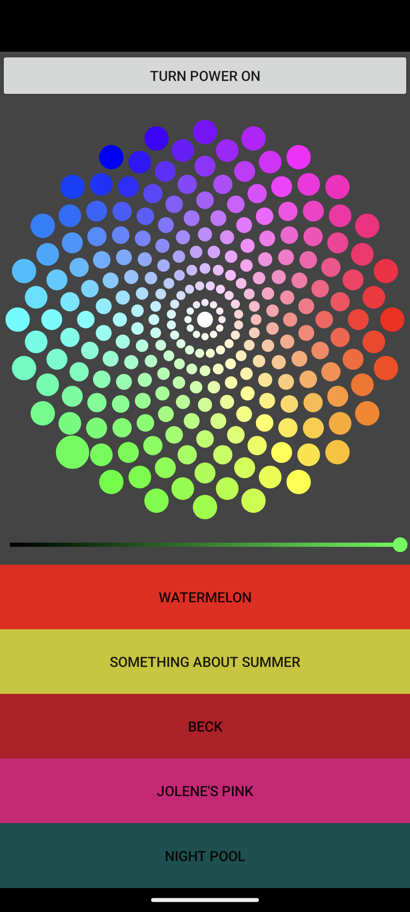

# Tub Light System
This Tub Light system allows the user to change the color of the light in a bathtub through an Android App.

## Project Motivation and Description
I developed the Tub Light system after taking apart the light that came with our jetted tub to replace the lightbulb. 

The original light was simply an incandesecnt bulb with an on/off switch in a semi-water tight box. If you wanted a different color other than warm white, then you use a plastic color filter over the light port to acheive that color. The tub only came with blue and red filters, which was pretty limiting, and it was somewhat pricy to buy the remaining five color filters.

I imagined how I could improve this the tub light using a [Adafruit NeoPixel Jewel RGB LED assembly](https://www.adafruit.com/product/2859?gad_source=1&gclid=CjwKCAiAp5qsBhAPEiwAP0qeJkzRK5o67oNMlqqDC8S1sDyIZCz12_C3Y6A9JUmND2r-IASDWLSKcRoCs48QAvD_BwE) to acheive any color and brightness I wanted. The NeoPixel Jewel is controlled by a [Sparkfun ESP32 Thing Plus](https://www.sparkfun.com/products/15663?gclid=CjwKCAiAp5qsBhAPEiwAP0qeJnRRSU4OE6ZlrzAAaxC8sL1j2-f2hIqKbaGOr5SEi_CV_tvKprVjEhoCCmUQAvD_BwE)

#### Original Color Selection Demo Video Link and Tub Light System Demo Video Link:
 | 

## Technical Overview
The following sections describe the technical details of the Tub Light system.

### Hardware
- [Sparkfun ESP32 Thing Plus](https://www.sparkfun.com/products/15663?gclid=CjwKCAiAp5qsBhAPEiwAP0qeJnRRSU4OE6ZlrzAAaxC8sL1j2-f2hIqKbaGOr5SEi_CV_tvKprVjEhoCCmUQAvD_BwE) to communicate via WiFi and control the RGB light. 
- [Adafruit NeoPixel Jewel RGB LED assembly](https://www.adafruit.com/product/2859?gad_source=1&gclid=CjwKCAiAp5qsBhAPEiwAP0qeJkzRK5o67oNMlqqDC8S1sDyIZCz12_C3Y6A9JUmND2r-IASDWLSKcRoCs48QAvD_BwE) for RGB light. 
- Level Shifter for ESP32 (3V system) to [Adafruit NeoPixel Jewel RGB LED assembly](https://www.adafruit.com/product/2859?gad_source=1&gclid=CjwKCAiAp5qsBhAPEiwAP0qeJkzRK5o67oNMlqqDC8S1sDyIZCz12_C3Y6A9JUmND2r-IASDWLSKcRoCs48QAvD_BwE) (5V system) using TI's [SN74AHCT125 Octal Buffer](https://www.ti.com/product/SN74AHCT125?utm_source=google&utm_medium=cpc&utm_campaign=asc-null-null-GPN_EN-cpc-pf-google-wwe&utm_content=SN74AHCT125&ds_k=SN74AHCT125&DCM=yes&gad_source=1&gclid=CjwKCAiAyp-sBhBSEiwAWWzTnt-SE3ptIo6v0rLhpGXk40SaxN7Lgv-MlV34kCT6CDqxO0mAszq7FxoCUzwQAvD_BwE&gclsrc=aw.ds)
- USB B plug for power from a 5V USB power supply.
- Pneumatic push switch tied to ESP32 digital input ISR line to toggle power on and off.
- Water tight box with cable gland for RGB light wiring.

### Firmware
- Connects to household WiFi, for local network use only.
- 4 hour inactivity auto light shut off.
- Physical button turns light on and off via interrupt service routine.
- The light can also be turned on and off via WiFi commands.
- Uses a WebServer to establish initial connection with App and reports light state to App.
- Uses a UDP port to receive on/off and color change messages.
- UDP messages are sent via JSON formatted text. The firmware must deserialize the JSON message to set the proper light color.
- Firmware Updatable via FOTA from Arduino IDE.
  
### Android App
- Based on MVC architecture
- Turn light on or off with power button at top.
- Select from any color on the color wheel.
- If color is selected from the color wheel, then it can be dimmed with the slider bar.
- Our favorite colors are set as favorites with the button the color the light will be.
- Retrieves the status of the light at startup from the WebServer running on the ESP32, sets power on/off appropriately.
- Sends commands via UDP to the ESP32 to set the light color, brightness, or to turn the light on/off.
  
#### Screenshots:
| Initial Screen | Light Dimmed |
| :--------------: | :------------: |
|  | |

## Future Feature Development List
- Slow Color Change
- Candle/Fire Flicker
- User based favorite color list
- Move UDP code in App into ControllerCompositionRoot for depedency injection. 
